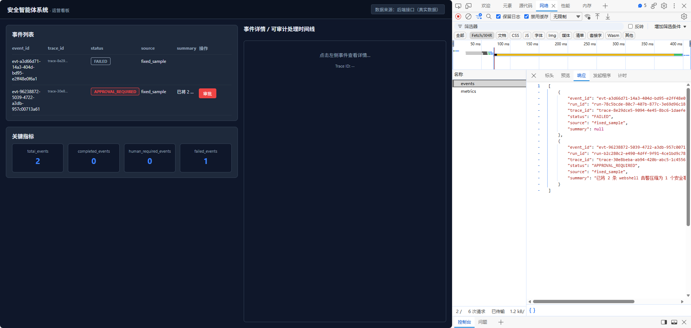
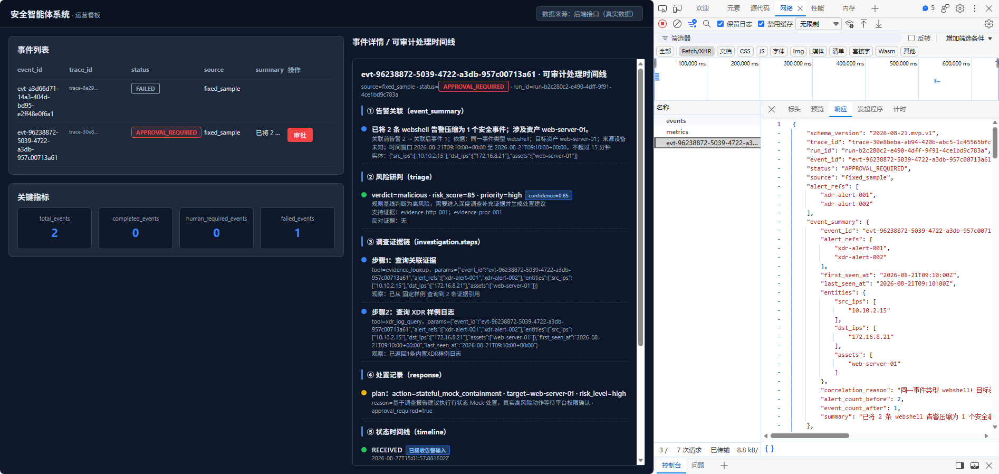
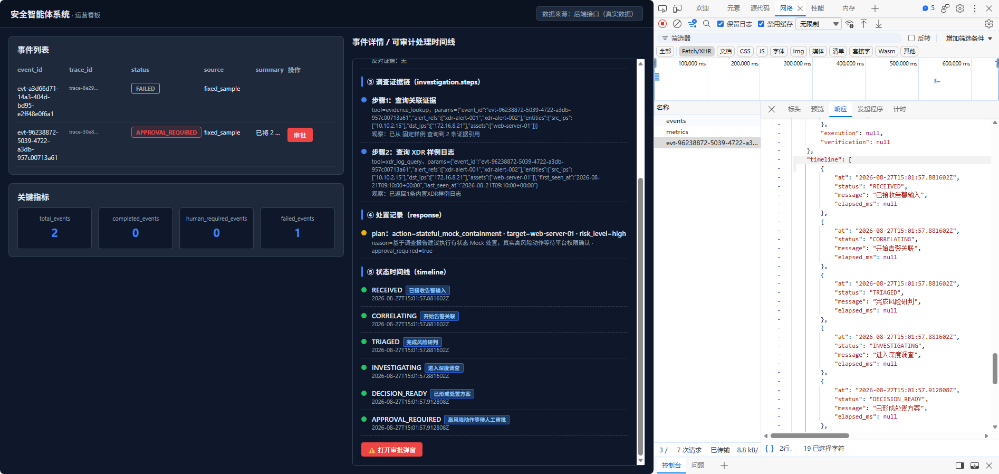
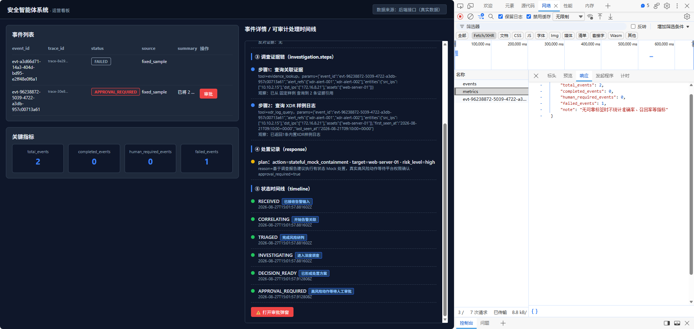
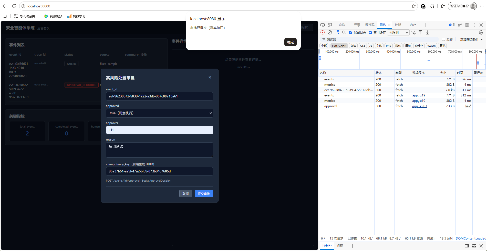
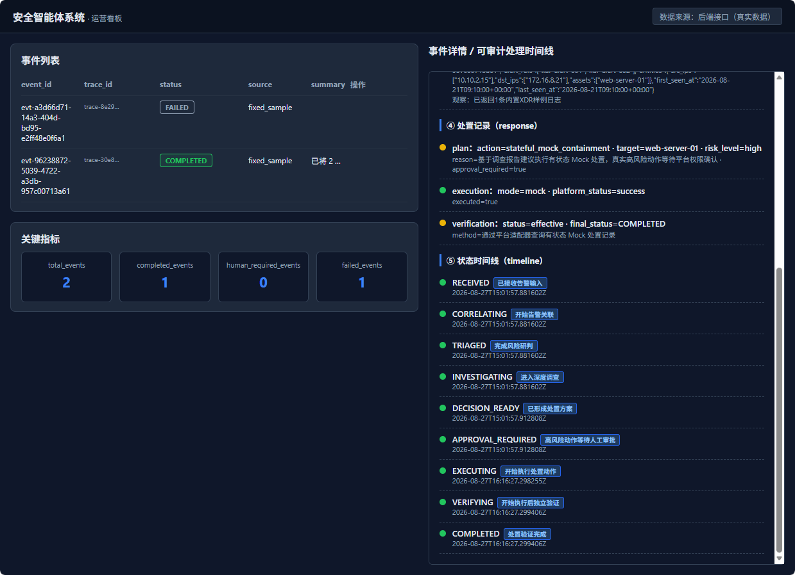
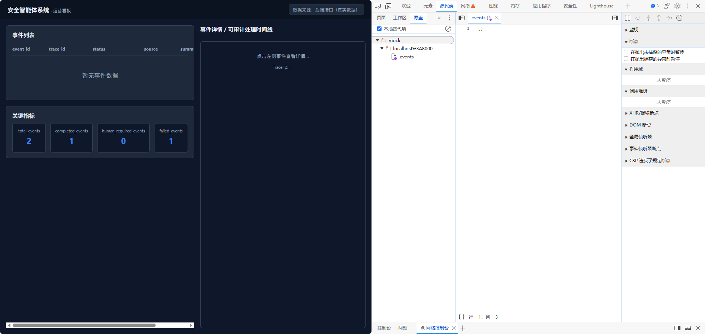
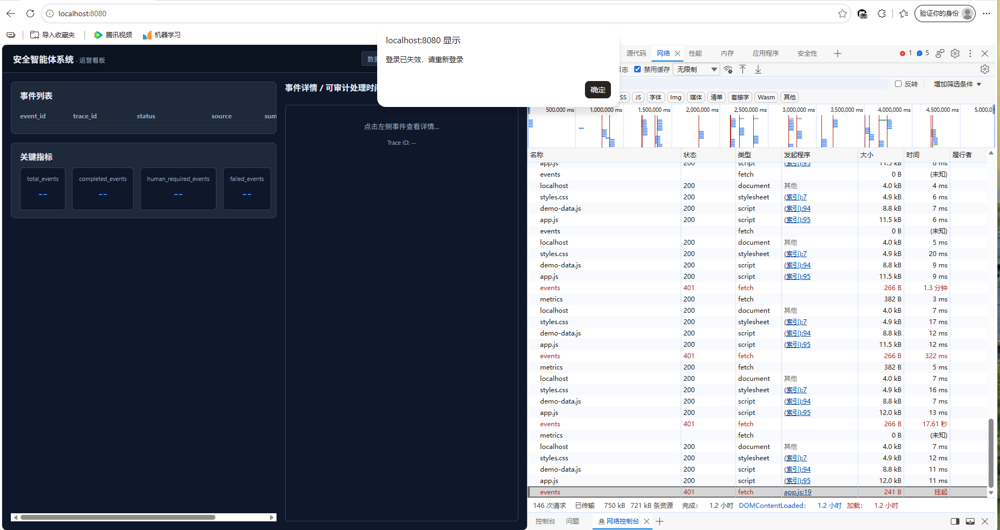
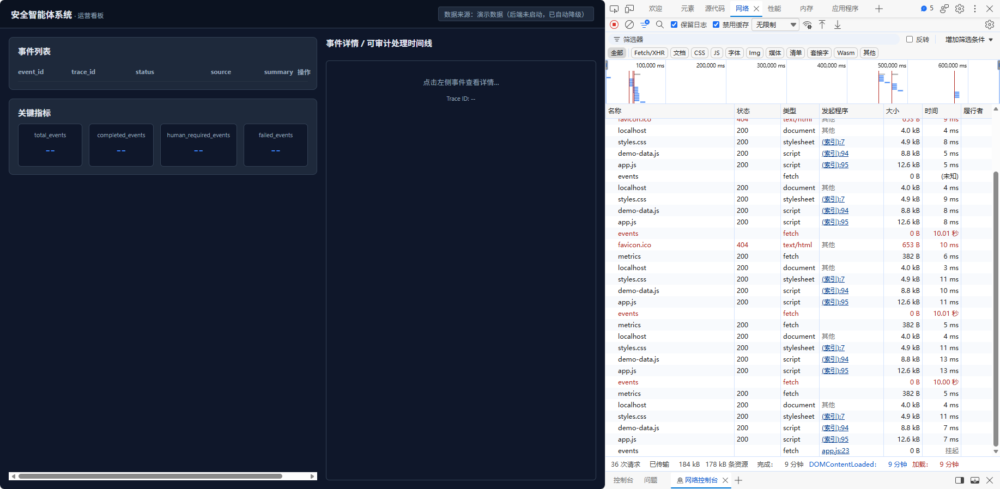

# 安全事件运营看板前端联调测试记录

## 0. 复验信息

| 项目 | 内容 |
|---|---|
| 模块 | 安全事件运营看板前端联调 |
| 任务/测试批次 | 联调验收 |
| 执行人 | 黄佳丽 |
| 执行时间 | 2026-08-26 10:30 |
| 基线分支与Commit | main |
| 环境 | Windows 11, Python 3.11, Chrome 浏览器 |
| 数据集/样例版本 | 固定样例（fixed_sample） |
| 工作流/知识库版本 | 不适用 |
| 能力性质 | 自研代码 |
| 验收层级 | 接口 / 联调 |
| 总体结论 | 通过 |
| 关联正式交付章节 | 联调测试 |

## 1. 测试范围与不在范围内事项

### 1.1 本轮覆盖

- 5 个后端接口的功能验证（GET /events, GET /events/{id}, GET /events/{id}/timeline, GET /metrics, POST /events/{id}/approval）。
- 前端页面渲染正确性。
- 跨域配置有效性。
- 点击事件修复验证。

### 1.2 本轮未覆盖

- 后端异常路径（如 404、500）未单独测试（联调阶段仅验证正常流程）。
- 性能测试未执行。

## 2. 前置条件与测试数据

- 前置条件：后端服务运行于 `http://127.0.0.1:8000`，前端服务运行于 `http://localhost:8080`。
- 测试数据性质：固定样例（fixed_sample），通过 `POST /runs` 生成。
- 测试数据位置：后端自动生成，无需外部文件。

## 3. 真实执行命令

```text
# 启动后端
cd /d 后端本地路径
.\venv311\Scripts\activate
uvicorn sec_agent.api.app:app --reload --app-dir src

# 启动前端（另一 CMD）
cd /d 前端本地路径
python -m http.server 8080

# 生成测试数据（在 Swagger 或 curl）
curl -X POST http://127.0.0.1:8000/runs -H "Content-Type: application/json" -d '{"source":"fixed_sample"}'
```

## 4. 测试用例与实际结果

| 用例ID | 优先级 | 类型 | 场景/输入 | 预期结果 | 实际结果 | 状态 | trace_id | 证据编号 | 缺陷编号 |
|---|---|---|---|---|---|---|---|---|---|
| FE-LH-001 | P0 | 正常 | 打开首页，自动加载事件列表 | 左侧显示事件列表，非空 | 左侧显示多条事件，每条含 event_id、标题、状态 | Pass | 无 | EVID-001 | 无 |
| FE-LH-002 | P0 | 正常 | 点击第一条事件 | 右侧显示详情（告警、研判、调查、处置）和时间线 | 右侧正确展示各模块内容，时间线有序 | Pass | 无 | EVID-002 | 无 |
| FE-LH-003 | P0 | 正常 | 页面加载时自动获取指标 | 顶部显示 total_events 等指标 | 指标卡片正确显示数字 | Pass | 无 | EVID-003 | 无 |
| FE-LH-004 | P0 | 正常 | 在详情页点击"审批"按钮，填写表单并提交 | 弹窗关闭，页面刷新，审批状态更新 | 审批请求返回 200，事件列表刷新 | Pass | 无 | EVID-004 | 无 |
| FE-LH-005 | P1 | 异常 | 关闭后端，刷新前端页面 | 前端自动切换为演示模式，显示 Mock 数据 | 右上角显示"演示数据"，页面正常展示 | Pass | 无 | EVID-005 | 无 |
| FE-LH-006 | P1 | 正常 | 点击多个事件，验证详情切换 | 每次点击都能正确切换右侧详情 | 修复后所有点击均正常切换，无 JS 报错 | Pass | 无 | EVID-006 | 无 |

## 5. 结果汇总

| 指标 | 数量 |
|---|---:|
| 通过 | 6 |
| 失败 | 0 |
| 阻塞 | 0 |
| 未执行 | 0 |
| 不适用 | 0 |
| 测试框架skipped（如有） | 0 |

- 关键状态时间线或输出摘要：所有接口返回 200，前端渲染正常，审批提交成功。
- 实际调用的Agent、工具或fallback：无。
- 与预期不一致项：无。

## 6. 指标贡献与原始计数

| 指标 | 计算口径 | 分子/原始计数 | 分母/原始计数 | 结果 | 数据或脚本证据 |
|---|---|---|---|---|---|
| 接口成功率 | 返回 200 的接口数 / 总调用次数 | 5 | 5 | 100% | EVID-001~004 |
| 前端渲染正确率 | 正确渲染的模块数 / 总模块数 | 4（列表、详情、时间线、指标） | 4 | 100% | EVID-001~003 |

## 7. 证据索引

| 证据 | 位置 | 脱敏状态 | 支持的结论 |
|---|---|---|---|
|  | 截图 EVID-001 | 已脱敏 | 接口返回 200 和非空数组 |
|  | 截图 EVID-002 | 已脱敏 | 接口返回 200 和完整详情 |
|  | 截图 EVID-003 | 已脱敏 | 接口返回 200 和指标数据 |
|  | 截图 EVID-004 | 已脱敏 | 审批提交返回 200 |
|  | 截图 EVID-005 | 已脱敏 | 真实数据渲染正常，点击切换正常 |

## 8. 失败项与已知限制

| 问题 | 复现方式 | 影响 | 当前处理/下一步 |
|---|---|---|---|
| 无 | — | — | — |

## 9. 验收结论

- 本轮可确认：前端与后端 5 个接口联调全部通过，前端渲染正确，点击事件修复有效，跨域配置正常，降级机制可用。
- 本轮不能确认：后端接口的健壮性（异常输入、并发等）未测试。
- 是否影响上下游或主链：否。
- 建议状态：已验收。

## 10. 变更记录

| 日期 | 基线Commit | 新增或变更测试 | 结论 |
|---|---|---|---|
| 2026-08-26 | 无 | 首次联调测试 | 通过 |


# T0827-04 数据来源与最终前端联调

## 基础信息
- **前端Commit**：https://github.com/Spark-Patrol-Team/spark-sec-agent-fe/pull/new/feature/frontend-resilience-0827
- **后端候选Commit**：未知
- **测试时间**：2026-08-27
- **前端地址**：http://localhost:8080
- **后端地址**：http://localhost:8000
- **run_id / trace_id**：无
- **数据性质**：real_xdr (正常) / mock / fixed_sample / demo (降级)

## 验证表格
| 检查项 | 接口 | HTTP状态 | 页面结果 | 是否使用demo-data.js | 证据 |
| :--- | :--- | :---: | :--- | :---: | :--- |
| 事件列表 | GET /api/events | 200 | 正常显示，标签正确 | 否 |  |
| 事件详情 | GET /api/event/:id | 200 | 正常显示 | 否 |  |
| 时间线 | GET /api/timeline | 200 | 正常显示 | 否 |  |
| 指标 | GET /api/metrics | 200 | 正常显示 | 否 |  |
| 审批 | POST /api/approval | 200 | 成功，状态流转 | 否 |  |
| 最终状态 | - | - | COMPLETED | 否 |  |
| 空结果 | GET /api/empty | 200 | 显示“暂无数据” | 否 |  |
| 鉴权失败 | GET /api/unauth | 401 | 提示登录失效 | 否 |  |
| 超时/Fallback | GET /api/timeout | - | 显示演示数据 | 是 |  |

## 结论
- **正常联调**：✅ 未触发演示数据，数据来源标识清晰。
- **异常状态**：✅ 鉴权、超时、空结果均可识别，未冒充真实数据。
- **降级逻辑**：✅ 仅在后端不可用时降级。

## 已知问题
- 无
